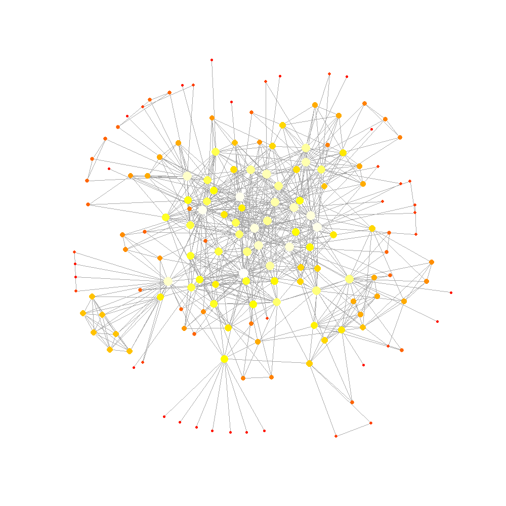
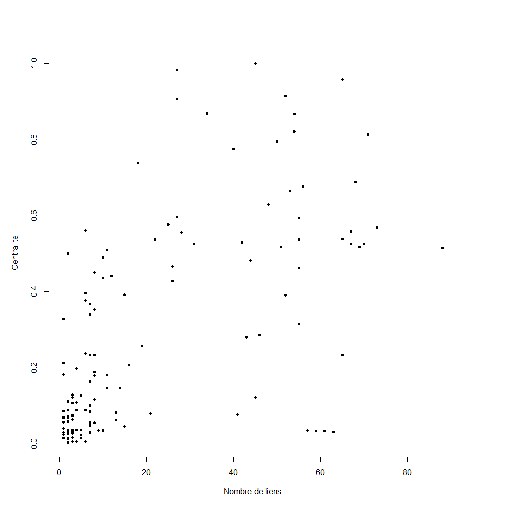
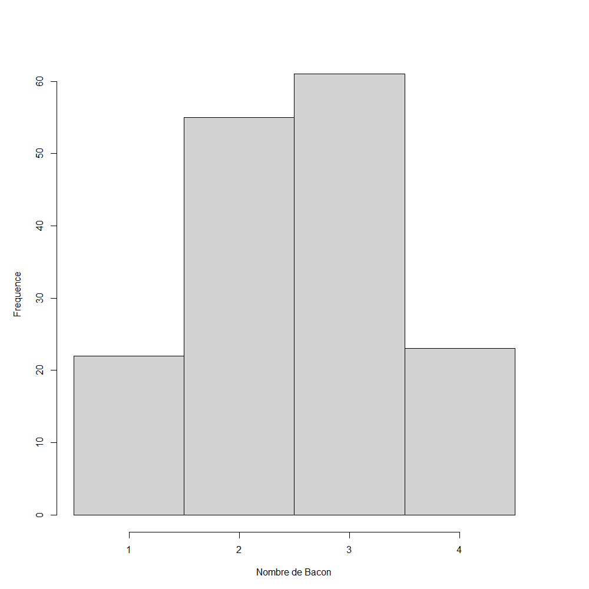

# introduction

Les relations qu'entretiennent les individus sont fortes, nombreuses et surviennent dans un but bien précis. Ce type de connexions entre deux individus peut parfois mener à tracer un gigantesque réseau de relations. Un type de réseaux souvent utilisé est le réseau de petit monde où il est possible de voir quel individu a interagi avec quel individu de façon à former une énorme schématisation linéaire. Dans ce rapport, nous utiliserons ce type de réseau pour bien démontrer les collaborations ayant eu lieu entre les étudiants du cours BIO500 à la session d'hiver 2023. Ce rapport ainsi que la production de ce type de réseau est réalisé dans le but de répondre à certains objectifs. Le premier objectif est la réalisation d'un réseau pour schématiser les collaborations entre les étudiants. Le deuxième objectif est de savoir si le Bacon number de chaque étudiant par rapport à un étudiant de référence. Notre dernier objectif est de déterminer s'il existe une corrélation entre le nombre de collaborations par étudiant ainsi que sa centralité dans le réseau de collaboration effectué.

# Méthode

Pour ce qui est de la méthode, nous avons commencé par cumuler des données au niveau des étudiants participants au cours BIO500 pour établir les liens que ces derniers ont eus durant leurs sessions précédentes ainsi que la session présente. Les informations récoltées par étudiant étaient nombreuses et elles ont pu être séparées en trois classes distinctes soit la section étudiante, la section collaboration et la section cours. Dans la section étudiante, l'information récoltée concernait le nom complet de l'étudiant, la région administrative, le régime coop, la formation préalable, l'année de début de programme ainsi que le programme. Cu côté de la section collaboration on retrouvait de l'information concernant les deux étudiants qui ont collaboré, le sigle du cours dans lequel ils ont collaboré ainsi que la session. Finalement du côté de la section cours on y trouvait de l'information sur le fait que le cours soit à option ou non ainsi que le nombre de crédits. Par la suite, à l'aide du logiciel R, il a été possible d'effectuer le nettoyage des données pour notamment effacer les doublons et les erreurs d'orthographe. Par la suite, il a été possible d'injecter les données ainsi que d'en faire des analyses encore via le logiciel R. Finalement, nous avons créé des figures nous permettant de répondre à nos questions scientifiques et de bien expliquer les résultats obtenus. Lors du travail d'équipe, la plateforme GitHub a été utilisée pour garder des traces des manipulations effectuées par chacun. Finalement, un script target a été assemblé pour permettre de facilité la lecture du code dans le logiciel R.

# Résultats

{width="500"}

Au niveau de la figure 1, il est possible de voir le réseau de collaboration entre les étudiants qui nous démontre le nombre de liens pour chaque étudiant. Dans cette figure, chaque point, qu'il soit gros ou petit, correspond à un étudiant et chaque ligne correspond à une relation entre deux points. De plus, les points vont avoir des grosseurs ainsi que des couleurs différentes. Un point plus gros et plus pâle signifie un étudiant avec beaucoup de collaborations tandis qu'un petit point foncé signifie un étudiant avec peu de collaborations.

La figure 2, de son côté nous informe de la corrélation entre le nombre de liens ainsi que de la centralité entre tous les étudiants présents dans l'étude. Il est possible de déterminer que la corrélation suit une petite tendance positive dans notre cas. Il est important de noter que les résultats de cette distribution sont significatifs étant donné que le P \< 0,05.

{width="500"}

Au niveau de la figure 3, il est possible de voir le degré de séparation entre les étudiants ainsi que l'étudiante Magalie Bossé. Donc il est possible de conclure que la majorité des étudiants possède un degré de séparation entre les valeurs 2 et 3, étant donné que ce sont les colonnes les plus hautes du graphique.

# Discussion

Pour commencer, si l'on regarde la figure 1, il est possible de voir que ce type de réseau est bel et bien considéré comme étant un réseau petit monde. En effet, comme il a été possible de constater, les connexions entre les étudiants sont nombreuses et l'on peut affirmer que les étudiants sont tous reliés. Comme démontrer dans une étude de psychosociologie (Milgram [1967]), il est possible de relier deux individus quelconques à travers de multiples connexions en se fixant un nombre maximal de 6 degrés de séparation (1). L'expression 6 degrés de séparation signifie qu'il va y avoir un maximum de 6 interactions entre deux différents individus pour qu'ils soient reliés (1). On peut donc conclure dans notre cas que cette règle s'applique si l'on regarde le nombre de liens entre 2 étudiants étant extrêmement distancés.

La figure 2, de son côté, nous démontre le nombre de collaborations pour chaque étudiant en fonction de leur centralité dans le réseau de collaborations établi. La centralité ne mesure pas le nombre de liens, mais plutôt à quel point le nœud occupe un certain type de position dans le réseau de collaboration (3). Donc, on peut affirmer que la centralité est plutôt associée à l'importance de la position d'un nœud. Si un nœud se trouve à être le seul pont entre beaucoup d'individus, sa centralité va donc se trouver beaucoup plus grande que le reste (3). Dans notre étude, il est important de mentionner la centralité augmente lorsque le nombre de liens augmente. Ce résultat concorde pleinement avec celui relié à un réseau de type petit monde (1).

Du côté de la figure 3, il est possible de voir le nombre d'interactions qui vont venir séparer notre étudiante de référence, Magalie Bossé, et les autres étudiants présents dans le réseau de collaboration. Magalie Bossé est l'étudiante choisie étant donné qu'elle possède le plus de collaboration. Le nombre de bacon correspond au nombre d'interactions entre un individu et l'individu de référence (2). Comme mentionné précédemment, le nombre maximal de nœuds entre chaque individu est établi à 6 (1). Par exemple, une activité exécutée dans le monde des acteurs avec Kevin Bacon pour permettre de retracer le nombre de bacon pour chaque acteur en référence à K. Bacon (2). Donc un acteur ayant participé au même film que Kevin Bacon possède un nombre de 1. Dans notre cas, les nombres oscillent entre 1 et 4 et la majorité des bacon number se trouve à être 2 ou 3 (figure 3). Nos résultats concordent donc parfaitement avec la littérature étant donné que le nombre maximal de nœuds entre notre étudiant de référence et un autre étudiant est de 4.

# Conclusion

Pour conclure, l'objectif principal qui consistait en la réalisation d'un réseau de type petit monde pour les relations entre les étudiants du cours de BIO500 de l'Université de Sherbrooke à l'hiver 2023 a été réalisé. Par la suite, le bacon number de chaque individu a pu être calculé en fonction d'un individu de référence pour voir si les bacon number obtenus dépassaient le seuil de la littérature qui était de 6. Le nombre maximal obtenu était de 4 donc cela concorde. Finalement, nous avons pu déterminer la corrélation entre le nombre de liens ainsi que la centralité de chaque étudiant à l'aide d'une représentation via un nuage de points. De plus, il pourrait être intéressant d'effectuer un test de centralité différent étant donné qu'il existe plusieurs centralités. Par exemple, une centralité axée sur la proximité des nœuds permettrait de trouver une centralité axée sur la personne qui est le plus près de tous les autres individus du réseau (3).

\newpage

# Bibliographie {.unnumbered}
